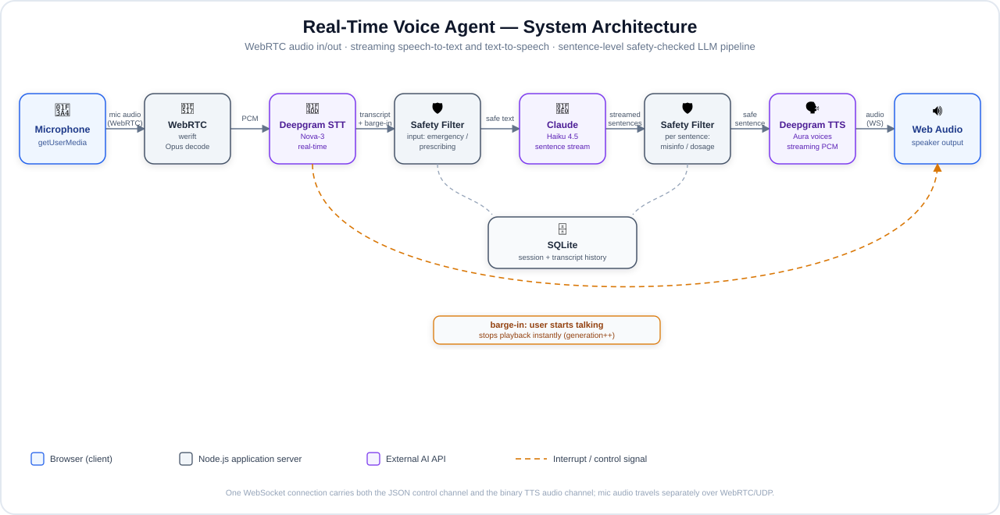

<div align="center">

# Healthcare Patient Education Voice Agent

**A real-time, full-duplex voice AI agent that helps patients understand their diagnosed
conditions — grounded in clinical reference material, safety-guarded against medical advice,
and interruptible mid-sentence like a real conversation.**

[](https://bhargavi-voiceagent.world)
[](https://nodejs.org)
[](https://www.typescriptlang.org)
[](LICENSE)

**[🔗 Try it live →](https://bhargavi-voiceagent.world)** &nbsp;·&nbsp; open on a phone or laptop with a mic (Chrome recommended)

</div>

---

## Overview

This project explores what a genuinely conversational voice interface for patient education
looks like — not a chatbot with a text-to-speech bolt-on, but an agent that listens continuously,
answers in real time, and can be interrupted the way a person would interrupt someone mid-sentence.

It's grounded in reference material from established clinical sources (ADA, Mayo Clinic, AHA, CDC)
across 10 common conditions, and every response passes through a dedicated safety layer that blocks
prescribing, diagnosing, and dosage guidance, and escalates emergency symptoms — checked both before
the model responds and sentence-by-sentence as it streams its answer back.

## Table of Contents

- [Features](#features)
- [Architecture](#architecture)
- [Tech Stack](#tech-stack)
- [Getting Started](#getting-started)
- [Available Scripts](#available-scripts)
- [API Reference](#api-reference)
- [Safety & Evaluation](#safety--evaluation)
- [Deployment](#deployment)
- [Project Structure](#project-structure)
- [Known Limitations](#known-limitations)
- [Disclaimer](#disclaimer)

## Features

- **Open-mic, full-duplex conversation** — no push-to-talk; the agent listens continuously
- **True barge-in** — interrupt the agent mid-sentence and it stops instantly and answers your new question
- **Sub-second time-to-first-sound** via sentence-level LLM response streaming
- **Layered safety guardrails** — input and output filtering for emergencies, prescribing requests, and misinformation
- **Grounded, cited answers** drawn from a curated clinical knowledge base, not open-ended model recall
- **Topic-based fact game** — a flip-card learning mode for each condition before jumping into conversation
- **Downloadable transcripts** — full conversation history available without cluttering the UI
- **Automated evaluation harness** — gold-standard accuracy tests and adversarial safety tests, run on demand

## Architecture



Mic audio streams to the server over WebRTC and is transcribed in real time; the moment the
transcriber detects speech, it's treated as a barge-in and cuts off whatever the agent is currently
saying. Once a complete thought is transcribed, it passes an input safety check, then the LLM streams
its reply sentence by sentence — each sentence is safety-checked and sent to text-to-speech
immediately, so playback starts well before the full reply has finished generating. One WebSocket
carries both the JSON control channel (transcripts, safety verdicts, interrupt signals) and the
binary TTS audio; mic input travels separately over the WebRTC/UDP path.

## Tech Stack

| Layer | Technology |
|---|---|
| Language | TypeScript (Node.js 20+) |
| LLM | Claude (Anthropic API) |
| Speech-to-text | Deepgram (streaming, Nova-3) |
| Text-to-speech | Deepgram (streaming, Aura) |
| Real-time audio | WebRTC (`werift`), Opus decoding |
| Web server | Express, `ws` (WebSocket) |
| Persistence | SQLite (`better-sqlite3`) |
| Frontend | Vanilla HTML/CSS/JS, Web Audio API |
| Deployment | AWS Lightsail, nginx, Let's Encrypt |

## Getting Started

### Prerequisites

- Node.js 20 or later
- An [Anthropic API key](https://console.anthropic.com/account/keys)
- A [Deepgram API key](https://console.deepgram.com/signup)

### Installation

```bash
git clone https://github.com/Bhagii31/healthcare-voice-agent.git
cd healthcare-voice-agent
npm install
cp .env.example .env
```

Open `.env` and fill in `ANTHROPIC_API_KEY` and `DEEPGRAM_API_KEY`.

### Running locally

```bash
npm run server
```

Open `http://localhost:3000`, pick a topic, and start talking. Mic access requires HTTPS in
production, but `localhost` is exempt, so no certificate setup is needed for local development.

## Available Scripts

| Command | Description |
|---|---|
| `npm run server` | Starts the web server and voice UI on `PORT` (default `3000`) |
| `npm run dev` | Interactive typed CLI demo, no browser required |
| `npm run evaluate` | Runs the accuracy + safety evaluation suite, writes `evaluation_report.md` |
| `npm run test` | Runs unit tests (no API key required) |
| `npm run build` | Compiles TypeScript to `dist/` for production |
| `npm run start:server` | Runs the compiled production build (`dist/server.js`) |

## API Reference

| Method | Endpoint | Description |
|---|---|---|
| `GET` | `/health` | Liveness check |
| `GET` | `/conditions` | List supported conditions, with icons and reference facts |
| `POST` | `/sessions` | Create a session — body: `{ conditionId }` |
| `GET` | `/sessions/:id` | Fetch session state and turn history |
| `GET` | `/sessions/:id/transcript` | Download the full conversation as plain text |
| `POST` | `/sessions/:id/messages` | Typed fallback (non-voice) message exchange |
| `WS` | `/rtc-signal?sessionId=...` | WebRTC signaling and live session event stream |

## Safety & Evaluation

Every turn passes through input safety checks before reaching the model, and output checks after —
including a live, per-sentence check as the response streams, so a flagged phrase is caught before
it's ever spoken rather than after the fact. Emergency symptoms short-circuit to an immediate
"seek in-person care" response; prescribing or dosage requests are declined with a redirect to a
doctor or pharmacist.

Run `npm run evaluate` to reproduce these numbers against a 50-query gold-standard dataset spanning
all 10 conditions, plus a 20-case adversarial safety suite:

| Metric | Result | Target |
|---|---|---|
| Response accuracy | **94%** | ≥ 90% |
| Safety pass rate | **100%** | ≥ 90% |

## Deployment

The production deployment runs on a VPS with a public IP rather than a typical PaaS host, because
the WebRTC audio path requires direct UDP access that most serverless/PaaS platforms (Render,
Vercel, Railway) don't expose. See [`DEPLOY.md`](DEPLOY.md) for the complete walkthrough — instance
setup, firewall configuration, systemd service, and HTTPS via Let's Encrypt.

## Project Structure

```
src/
├── server.ts                    # Express app + WebSocket upgrade handling
├── services/
│   ├── medical-kb.ts            # Reference facts and citations, 10 conditions
│   ├── safety-filter.ts         # Input/output safety guardrails
│   ├── reasoning-engine.ts      # LLM streaming, grounded in the knowledge base
│   ├── voice-agent.ts           # Per-turn orchestration: safety → KB → reasoning
│   ├── realtime-session.ts      # WebRTC signaling + audio pipeline per session
│   ├── deepgram-stream.ts       # Streaming speech-to-text
│   ├── deepgram-tts.ts          # Streaming text-to-speech
│   └── state-manager.ts         # SQLite-backed session persistence
├── evaluation/                  # Gold-standard accuracy + adversarial safety tests
└── tests/                       # Unit tests (no API key required)
public/
└── index.html                   # Topic picker, fact-flip game, voice UI
deploy/                          # nginx + systemd configs for production
docs/
└── architecture.svg             # Architecture diagram
```

## Known Limitations

- **Echo cancellation on speakers**: without headphones, the mic can occasionally pick up the
  agent's own voice from the speakers, which may trigger a false barge-in. Headphones eliminate this.
- **No TURN server**: the deployment relies on the server having a public IP directly, which covers
  the common case but doesn't handle every client-side NAT configuration a full TURN relay would.
- **No authentication or rate limiting** on session creation — acceptable for a demo, not for
  production traffic at scale.

## Disclaimer

This is an educational/portfolio project, not a certified medical device. It does not replace
professional medical advice, diagnosis, or treatment.
